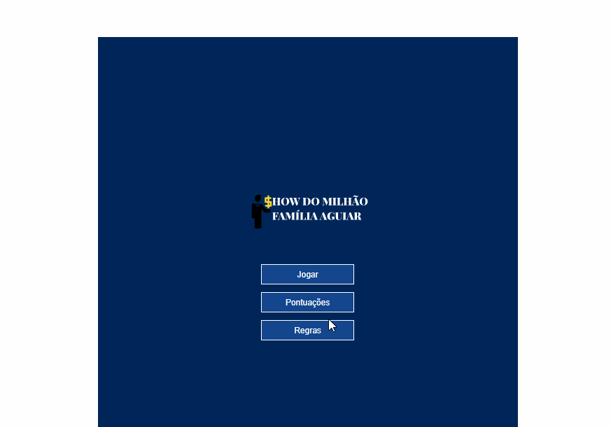

<h1 align="center">



</h1>

## Índice
- [Sobre](#-sobre)
- [Diferenças do jogo](#-Diferenças-do-jogo-original)
- [Como baixar o projeto](#-Como-baixar-o-projeto-e-jogar)
- [Tutorial](#Tutorial)
- [Tecnologias utilizadas](#-Tecnologias-utilizadas)

---

## 🎮 Sobre

O projeto **Show do Milhão Família Aguiar** consiste num jogo de perguntas e respostas com inspiração no clássico Show do Milhão.<br>
O projeto faz parte do desafio da empresa **Jovens Gênios** para uma vaga de estágio na área de desenvolvimento.

---

## 📌 Diferenças do jogo
- tempo total: 2 minutos para responder todas as perguntas
- sem ajuda dos universitários
- sem opção de pular perguntas
- sem cartas que eliminam alternativas
- sem placas de ajuda da plateia
---

## 💼 Como baixar o projeto
```bash
  # clonar o repositório
  $ git clone https://github.com/brunoluizsilva/showdomilhao
```
- instalar a extensão live server ou semelhante no **Vs Code**
  
- abrir a pasta do projeto e clicar em **GO LIVE** no **Vs Code**.
---
## 👨🏻‍🏫 Tutorial

[](http://www.youtube.com/watch?v=sftLy_dcq-Q "Tutorial - Show do Milhão Família Aguiar")


---

## 💻 Tecnologias utilizadas

O jogo foi desenvolvido utilizando as seguintes tecnologias:

- HTML
- CSS
- JavaScript
---

<p align="center">Desenvolvido por Bruno Silva <p>